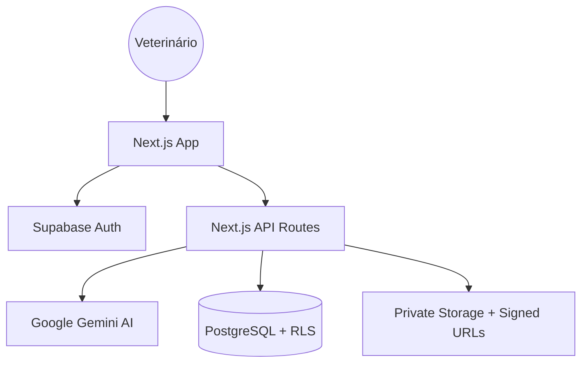

<div align="center">

# 🐾 ProntuVet

**Copiloto clínico com IA para médicos-veterinários.**
Transforma a conversa da consulta em prontuário estruturado — em segundos.

[](LICENSE)
[]()
[](https://clinic-scribe-ai-1-1.vercel.app)
[]()

**[→ Ver demo ao vivo](https://clinic-scribe-ai-1-1.vercel.app)**

</div>

---

## 🛡️ Segurança e Boas Práticas (Auditado)

O ProntuVet foi submetido a uma auditoria técnica rigorosa para garantir a proteção de dados sensíveis e a robustez da aplicação.

### 🔒 Segurança de Dados (Supabase)
- **RLS (Row Level Security)**: 100% das tabelas possuem políticas ativas. Um veterinário nunca consegue acessar ou modificar dados de outro profissional.
- **Buckets Privados**: O armazenamento de áudios e anexos clínicos é estritamente privado. O acesso é feito via **Signed URLs** que expiram em 1 hora, garantindo que arquivos nunca fiquem públicos na internet.
- **Policies por User ID**: Todas as operações de banco e storage validam o `auth.uid()` do usuário autenticado no nível do PostgreSQL.

### 💻 Engenharia de Software
- **Type Safety**: TypeScript estrito em toda a base de código, eliminando erros comuns em tempo de execução e garantindo interfaces de dados confiáveis.
- **Fail-Fast Validation**: Validação rigorosa de variáveis de ambiente e chaves de API logo no carregamento da aplicação.
- **Sanitização de Inputs**: Proteção nativa contra variantes de SQL Injection em buscas textuais complexas.
- **Race Condition Protection**: Implementação de `AbortController` em requisições assíncronas para manter a interface consistente e evitar sobrescritas de estado.

---

## 🚀 Funcionalidades Principais

- 🎙️ **Escuta em tempo real** — captura o áudio da consulta diretamente no navegador.
- 📝 **Transcrição e Estruturação via Gemini** — converte fala em prontuários estruturados (Anamnese, Exame Físico, Diagnóstico, Prescrição).
- 📁 **Gestão de Anexos** — upload seguro de laudos e imagens exclusivas por consulta.
- 🎨 **Templates de Sistema e Próprios** — modelos de prontuário selecionáveis que persistem na conta do usuário.
- 💬 **Resumo para o Tutor** — gera versões em linguagem acessível automaticamente.
- ⚡ **Timeline Clínica** — biografia médica completa do paciente com visualização cronológica inteligente.

---

## 🛠️ Stack Tecnológica

### Frontend & App
- **Next.js 14** (App Router)
- **Tailwind CSS** & **shadcn/ui**
- **Framer Motion** (animações fluidas e premium)

### Backend & Inteligência
- **Supabase** (PostgreSQL, Auth, Storage)
- **Google Gemini 2.5 Flash-Lite** (IA multimodal nativa)
- **Vercel** (Edge Computing)

---

## 🏗️ Arquitetura Técnica



---

## 🏃 Rodando localmente

1. **Clone e Instale:**
   ```bash
   git clone https://github.com/armitagethird/ProntuVet.git
   npm install
   ```

2. **Configure o `.env.local`:**
   ```env
   NEXT_PUBLIC_SUPABASE_URL=...
   NEXT_PUBLIC_SUPABASE_ANON_KEY=...
   GEMINI_API_KEY=...
   GEMINI_MODEL=gemini-2.5-flash-lite
   ```


3. **Inicie:**
   ```bash
   npm run dev
   ```

---

## 👨‍💻 Sobre o autor

**Romero Santos Saraiva** — `armitagethird`
Desenvolvedor focado em produtos com IA aplicada a problemas reais.

- [Portfolio](https://romerosaraiva.com)
- [LinkedIn](https://linkedin.com/in/romero-saraiva)
- [GitHub](https://github.com/armitagethird)

---

## 📄 Licença

**MIT License** — livre para estudo, adaptação e contribuição.
