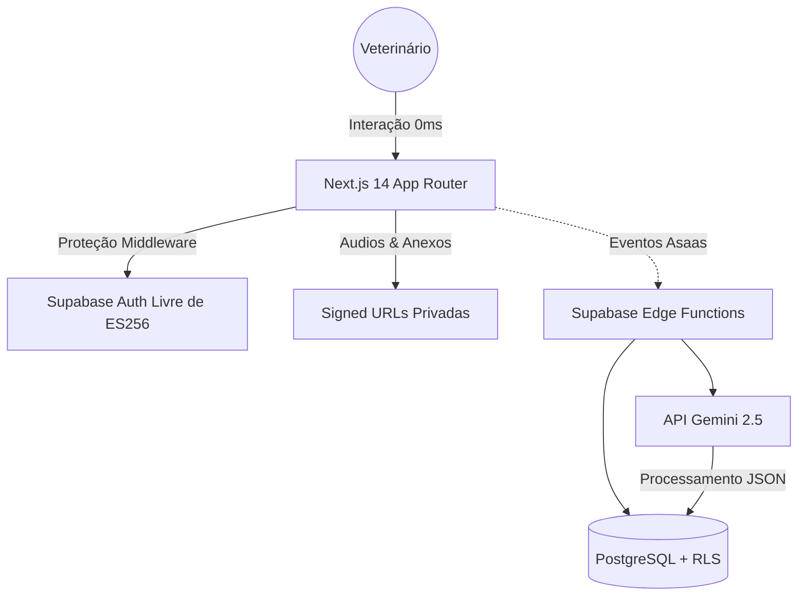

# 🐾 ProntuVet AI
**O Primeiro Ecossistema Clínico Copiloto para Médicos-Veterinários.**

No ProntuVet, transformamos a audição passiva de uma consulta clínica em um **prontuário médico rigorosamente estruturado, indexado e formatado** — tudo em meros segundos, sem interrupções e com privacidade zero-trust.

**[→ Explorar Plataforma ao Vivo](https://clinic-scribe-ai-1-1.vercel.app)**

---

## 🚀 A Revolução Clínica em Suas Mãos

O fluxo de trabalho de um médico-veterinário é exaustivo. O ProntuVet atua como um assistente invisível que consolida os eventos de forma autônoma.

- 🎙️ **Escuta Contínua (Edge AI):** Captura de áudio da consulta diretamente via navegador.
- 📝 **Inteligência Estruturadora:** A IA filtra conversas supérfluas e extrai anamnese, exame físico, diagnóstico e prescrições.
- 🔒 **Zero-Trust Storage:** Seus áudios, anexos médicos e exames são processados e imediatamente mantidos em **armazenamento privado** (Signed URLs).
- 💬 **Bilinguismo Sistêmico:** Gera resumos hiper-técnicos para seu histórico, e resumos amigáveis/acolhedores para o WhatsApp do Tutor.
- 💳 **Módulo de Assinaturas (Sistema Platinum):** Pagamento nativo processado via Asaas, com gerador de links automáticos e ativação via Webhook remoto.

---

## 🏗️ Engenharia e Arquitetura de Alto Padrão

Nossa missão é entregar uma UX irretocável garantindo uma engenharia corporativa. Durante a jornada de desenvolvimento do ProntuVet, arquitetamos um motor de máxima performance:

### ⚡ Estabilidade da Stack Gold (LTS)
Para evadir as falhas inerentes de frameworks em Release Candidate (RC) e compilações lentas, o projeto roda puramente na união testada pelo mercado: **Next.js 14.2.16** e **React 18.3.1**. O design system e animações rodam livres de *jank* de renderização via `Framer Motion` e `Tailwind CSS`.

### 🛡️ Defesa Criptográfica contra o ES256 Bug 
Resolvemos de ponta-a-ponta incompatibilidades em validações JWT em ambientes Serverless/Edge (Deno e Vercel), trancando as chaves de infraestrutura para versões cravadas (`@supabase/supabase-js 2.45.6`). Resultado? Zero quedas de roteamento, falhas de middleware, ou vulnerabilidades de autenticação cruzada.

*Fluxo Unificado de Autenticação, Processamento e Faturamento*

---

## 🔒 Segurança em Primeiro Lugar

Levamos o dado médico a sério. O ProntuVet é desenhado nativamente com os padrões **HIPAA-like** aplicados na engenharia de software moderno:

1. **Row Level Security (RLS) Nativo:** Nenhum veterinário tem acesso físico, via querier ou via cliente às linhas de outro profissional.
2. **Isolamento de IA (Anti-Hallucination):** Prompts estritos e injetados via infraestrutura Deno com validações duras (`is_valid_consultation`), reduzindo alucinações se o áudio não corresponder a medicina real.
3. **Limite de Rate Limit Restrito:** Segurança contra uso exaustivo e abusivo da IA e banco de dados isolados por tier de assinatura.

Para mais detalhes sobre as restrições arquiteturais e protocolos que devem ser mantidos ao contribuir para o código, veja nosso plano diretor: **[🛡️ DOCUMENTO DE SEGURANÇA (SECURITY.md)](./SECURITY.md)**

---

## 👨‍💻 Sobre e Autoria

**Romero Santos Saraiva** — `armitagethird`  
Desenvolvedor focando em empacotar IA de ponta para aplicações médicas que impactam a vida real.

- 🌐 [Portfolio Local](https://romerosaraiva.com)
- 💼 [LinkedIn](https://linkedin.com/in/romero-saraiva)
- 💾 [GitHub/armitagethird](https://github.com/armitagethird)

---

<i>A medicina cuida da vida. A inteligência cuida da medicina.</i>

